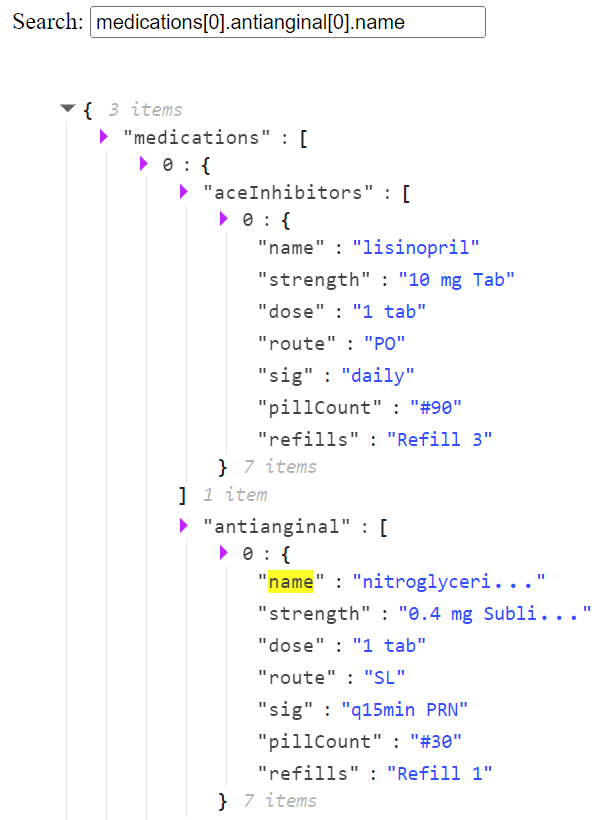

# searchable-react-json-node-view

This is a fork of [searchable-react-json-view](https://www.npmjs.com/package/searchable-react-json-view) with an extra search capability by traversing entire JSON structure.  
Please go there for the full readme.

### Install

```sh
yarn add searchable-react-json-node-view
```

### Example

<kbd></kbd>

